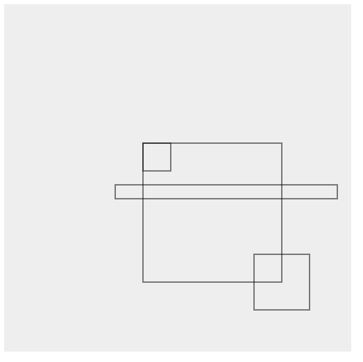
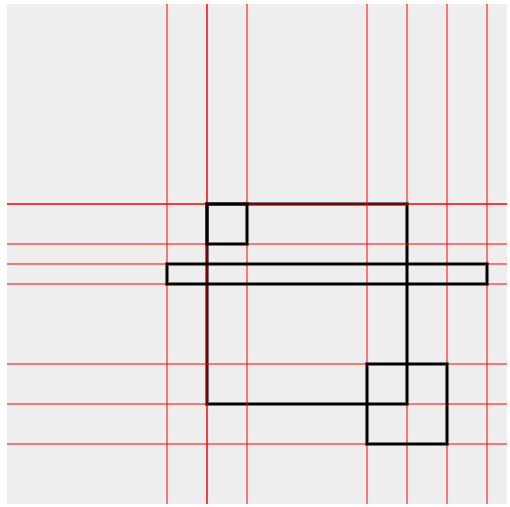

# 堆叠度计算
## 问题描述
对于目标检测等算法，可能存在多个标注框的堆叠，需要给出算法，求标注框的堆叠度。

标注框的堆叠度的意思是一张图中有a,b,c,d，其每一个框都用(x1,y1,x2,y2)来表述，如果a的面积中有一部分被b、c、d覆盖了，那么（被覆盖的部分面积）/（a的面积）就是a的堆叠度。
## 举例
对于下述框：
- a:100,100,200,200
- b:100,100,110,110
- c:190,190,200,200
- d:300,300,400,400

则a的堆叠度为(10×10+10×10)/(100×100)=0.02

## 解法
答案是离散化。

对于一个矩形（灰色图片）上面的多个小矩形（标注框），如下图所示（插图由chatGPT绘制，他真的很擅长canvas）：

考虑最朴素的做法，假设图片为500x500：
1. 对于每个像素，每次被标注框**填充**，那个像素的值+1
2. 在完成填充后，可以枚举标注框的x,y，每个像素值>=2的点，使其**被堆叠面积**+1
3. 这样就可以知道对于每个标注框，其被堆叠的面积是多少了

这样的做法，复杂度为O(wh)，w与h分别为图片宽高

为了能够缩小复杂度，考虑到可以将图片分割为多个小矩形，分隔的原则是单个矩形内的被堆叠次数**一定相同**。因此，可以画图如下（chatGPT没画出来，我自己画）：

可以很轻松的理解到，对于分隔出来的每个小格子的内部，有一个固定的面积，并且其被堆叠部分的次数是相同的

这一概念就是离散化。将多个x、y的值离散为1……n，从而快速地计算堆叠度。

对于这一方式，流程如下：
- 收集所有的x、y的值，去重
- 对x、y值分别进行排序，可以得到两个个从小到大排序的**序列**，xlist与ylist
- 定义一个二维矩阵mat，这个矩阵表示对于第[i][j]个矩形，被堆叠了多少次
- 枚举每一个标注框
    - 查找xlist中，值x1、x2的两个下标x1i，x2i（x1、x2一定在序列中）
    - 查找ylist中，值y1、y2的两个下标y1i，y2i
    - 

        for(i:x1i~x2i)
        for(j:y1i~y2i)
            mat[i][j]+=1
- 枚举每一个标注框
    - 查找xlist中，值x1、x2的两个下标x1i，x2i（x1、x2一定在序列中）
    - 查找ylist中，值y1、y2的两个下标y1i，y2i
    - 如果该标注框的覆盖范围中，mat的小格子的堆叠次数大于等于2，则该标注框的被覆盖面积就要加上这个小格子的面积

## 实现细节
实现的流程大致与上述做法类似：
- 对于标注框组，求离散化组
- 基于标注框组和离散化组，求小格子被堆叠的次数
- 对每个标注框，扫描其内部区域的堆叠次数大于等于2的小格子的面积和

但是使用java编程时，有一些可以优化的细节：
### 离散化
给定一组x、一组y，离散化的流程如下：
1. 对x去重，对y去重
2. 将x加入到列表xlist中，将y加入到列表ylist中
3. 对x排序，对y排序

但是，设计离散化的算法时，考虑后续需要根据value查找index/key，如果使用朴素的List的话，其查找时间是O(n)，这是由java的ArrayList的indexOf方法实现决定的。

的确对于有序数据，indexOf可以做到O(logn)的复杂度（二分查找），但是毕竟ArrayList不知道自身数据是否有序。

考虑到常见的倒排索引思想，用一个辅助数据结构（Map）记录<value,key>，用额外的O(n)的空间复杂度换来O(1)（HashMap）或O(logn)（TreeMap）的插入、查询复杂度。

因此，选定了两种数据结构试图代替List：
1. TreeSet<Integer>：基于红黑树实现，成员原生有序且无重复，插入、查询为O(logn)
2. LinkedHashSet<Integer>：基于链表+哈希表实现，成员顺序按照插入顺序排序，需要外部排序后插入，插入、查询为O(1)

考虑到Hash类的数据结构反复扩缩容带来的不稳定因素，最终决定使用TreeSet，这样甚至省去了去重与排序（红黑树底层是链表）。

因此，离散化代码如下：

        public static TreeSet<Integer>[] getDiscretion(Collection<int[]> intersections) {
        TreeSet<Integer>[] res = new TreeSet[]{new TreeSet<Integer>(), new TreeSet<Integer>()};
        for (int[] intersection : intersections) {
            res[0].add(intersection[0]);
            res[0].add(intersection[2]);
            res[1].add(intersection[1]);
            res[1].add(intersection[3]);
        }
        return res;
    }

非常的简单。

此外，在查询TreeSet时，要求是给定x1,x2（y1,y2），给出这一段区间，而对此，Java给出的函数是：

            SortedSet<Integer> subSetX = discretions[0].subSet(annotation[0], false, annotation[2], true);
            SortedSet<Integer> subSetY = discretions[0].subSet(annotation[1], false, annotation[3], true);

答案是子集。subSet函数可以给定区间以及其开闭状态，返回一个子视图。简单一想就可以知道这一实现一定是O(1)的，从而完全替代了使用List.indexOf+迭代的写法。

### 矩阵压缩
前文提到了，需要mat矩阵存储对于[i][j]，这个子模块的堆叠次数。

但是想想就知道这一定是一个稀疏矩阵，因为一张图片的标注框大概率不重叠，分割后，每个标注框覆盖的区域也是小部分。

教科书上说此时应该用邻接表，但是邻接表在插入、查询时，还是需要遍历链表。

考虑到数组下标一定是int（4bytes），而long（8bytes）正好可以表示两个int（x、y），因此考虑使用HashMap<Long,Integer>代替mat这个二维矩阵。

根据两个数组下标求Key的代码非常简单，考虑x在高32位，y在低32位，简单的位运算即可实现：

        public static long getCode(int x, int y) {
        return ((long) x << 32) | y;
    }

此外，对于mat[i][j]++，既然使用了HashMap，也可以用它提供的非常优雅的方式：

    blocks.compute(getCode(preX, preY), (k, v) -> (v == null) ? 1 : v + 1);

## 总结
综上，使用离散化的思想，就可以非常快速地计算出对于一组标注框，它们每个框的堆叠度了。

